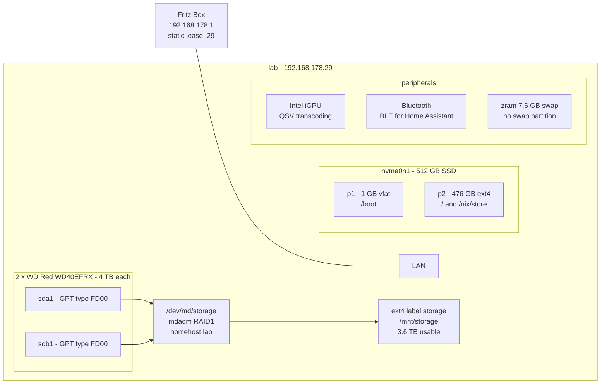
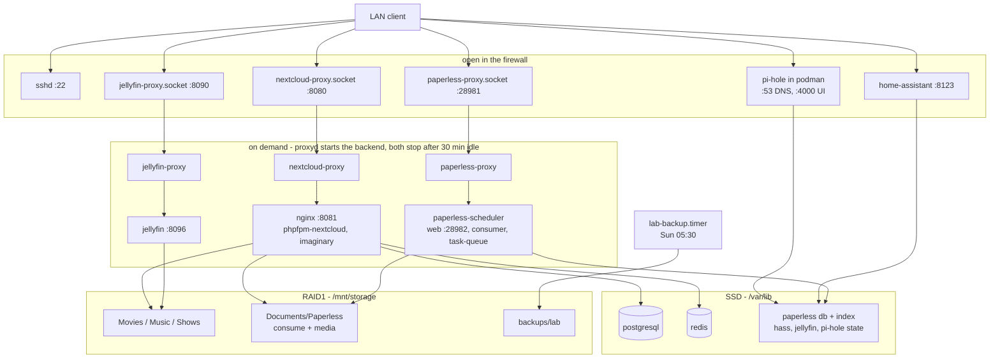

# Home Server - NixOS Configuration

Home server (`lab`) running Home Assistant, Jellyfin, Nextcloud, Paperless-ngx
and Pi-hole, built from a flake.

## Setup

### Hardware



The mirror is assembled by homehost and mounted by filesystem label, so no
disk, UUID or `/dev/mdN` is named anywhere in the repo; `docs/raid1.md` builds
one from blank disks.

### Software



The backend ports (8081, 8096, 28982) stay closed in the firewall: the sockets
are the only way in (`modules/on-demand.nix`). Not drawn are the other
scheduled jobs - `nix-gc` at 03:15, `nix-optimise` at 04:00 and `fstrim` at
04:30 on Sundays, `mdraid-scrub` on the first Saturday.

## Install

```bash
nix-shell -p git just
git clone https://github.com/antonkesy/home-server.git && cd home-server
just install
```

`just install` switches the system and sets the password for user `ak`.
Service passwords are generated on the switch (`gen-secrets`) and kept
across rebuilds. On a new machine run `just hardware` first, or
`just migrate` (hardware, install, restore). The two data disks have to be
built into the mirror once by hand; see **Storage** below.

## Services

| Service        | URL                     | Credentials                                   |
| -------------- | ----------------------- | --------------------------------------------- |
| Home Assistant | `http://lab:8123`       | set up on first visit                         |
| Jellyfin       | `http://lab:8090`       | set up on first visit                         |
| Nextcloud      | `http://lab:8080`       | `/var/lib/nextcloud/admin-pass` (user `root`) |
| Paperless-ngx  | `http://lab:28981`      | `/var/lib/paperless/admin-pass` (user `admin`) |
| Pi-hole        | `http://lab:4000/admin` | `/var/lib/pihole/pihole.env`                  |

`just passwords` prints them. Nextcloud reads its file at first setup only;
rotate with `just set-nextcloud-pw`, Pi-hole with `just set-pihole-pw`.

Jellyfin, Paperless and Nextcloud's web side (nginx, php-fpm, imaginary) are
on demand (`modules/on-demand.nix`): a socket holds the port, the first
connection starts the service, and 30 minutes after the last connection
closes it stops again (`onDemand.idleTimeout` in `settings.nix`). The first
request after a pause waits a few seconds. What that costs:

- Jellyfin's auto-discovery does not answer while it is off; point clients at
  the URL. Its scheduled tasks only run while it is up.
- A scan dropped into the Paperless consume folder waits until someone next
  opens Paperless.
- A Nextcloud sync client keeps the web side awake for as long as it runs.

## Day to day

`just --list` shows every recipe. Three things it cannot tell you:
`update` and `upgrade` only stage the next boot, `install` is the one recipe
that switches live, and `clean` drops the generations `rollback` needs.
Garbage collection also runs on its own every Sunday, keeping 30 days.

## Backup & restore

`just backup [dir]` writes one `lab-<date>.tar.zst` to
`/mnt/storage/backups/lab`; `lab-backup.timer` does the same every Sunday
morning and keeps the last eight (`backup` in `settings.nix`). Inside:

- the generated passwords, the SSH host keys
- Nextcloud: `config.php`, installed apps, app data, a Postgres dump
- Paperless: database and secret key (the search index is rebuilt on start)
- Home Assistant: `.storage` (integrations, auth, devices)
- Jellyfin: config, library database, plugins
- Pi-hole: `pihole.toml`, `gravity.db`, `dnsmasq.d`

Not inside: user files, media, Paperless documents, previews, caches, logs,
Home Assistant history. The mirror is what covers those, and it only covers
one disk dying - the archive now sits on the same machine as the state it
backs up, so fire, theft or a dead PSU takes both. `just backup /run/media/...`
onto an external disk now and then is the only thing that does not.
Jellyfin, Paperless and Pi-hole are stopped for the duration of the tar, so
LAN DNS is briefly gone; the copy is compared against the staged archive
after a sync.

`just restore [archive]` takes the newest archive in the backup dir, or a
path. It stops the services, extracts over `/var/lib`, recreates the
Nextcloud database, restarts `sshd` with the old host keys and re-runs
`nextcloud-setup`. Restore onto the same or a newer nixpkgs than the archive
(`manifest` inside says which).

## Notes

- **Site settings** live in `settings.nix`: hostname, addresses, ports,
  storage directories, timezone, git identity. The modules only read them.
- **SSH.** Password authentication stays on until a key is in
  `modules/users.nix`; then set `PasswordAuthentication = false` in
  `modules/ssh.nix`.
- **Pi-hole** is v6: settings use `FTLCONF_<section>_<key>` and are read-only
  in the web UI. Allow/deny entries are listed in `settings.nix`
  (`pihole.domains`) and added on every boot; deleting one there does not
  remove it from Pi-hole. The host itself resolves through public DNS, so a broken
  container cannot lock you out of `just rollback`.
- **LAN names.** Pi-hole serves `lab` and `lab.fritz.box` from the server's
  `/etc/hosts`; everything else under `fritz.box` is forwarded to the router,
  because `fritz.box` is a real public domain.
- **Nextcloud** is trimmed to file sharing: `nextcloud-disable-apps` turns
  the stock dashboard, activity, photos and similar apps off on every boot,
  cron runs every 15 minutes. Upgrade one major version at a time
  (`nextcloud35` only once 34 has migrated, see `nextcloud-occ status`).
- **Storage** (`modules/storage.nix`): two 4 TB disks as one mdadm RAID1
  mirror, ext4, mounted at `/mnt/storage` with the directories listed in
  `storage.dirs`. `just storage` prints the array state; `mdmonitor` logs a
  degraded array through `systemd-cat`, `smartd` warns about a dying disk,
  and `mdraid-scrub` read-checks the mirror on the first Saturday of the
  month (`storage.scrubOnCalendar`), which takes hours at low priority.
  Assembly is by homehost, so there is no `ARRAY` line to keep in sync, and
  the mount is by filesystem label, so the config holds before the array
  exists: `mdadm --create ... --homehost=lab --name=storage` over one
  `FD00` partition per disk, then `mkfs.ext4 -L storage`. The mount is
  `nofail`, and every unit that writes there waits on it with
  `RequiresMountsFor` rather than risk building a tree on the SSD.
  `storage-dirs` re-asserts `ak:lab` and `2775` on every boot, plus a
  default ACL, which is what makes the creating process's umask irrelevant
  and lets `nextcloud`, `paperless` and `ak` write each other's files.
  Unlike the NAS this replaced, the disks spin around the clock. Point
  Jellyfin libraries at `/mnt/storage/{Movies,Music,Shows}`; Nextcloud
  mounts everything but `backups/` as external storage on boot.
- **Paperless** keeps its documents in `/mnt/storage/Documents/Paperless`
  (`paperless.dir`, `Documents/Paperless` in Nextcloud). Drop a scan into
  `consume/` by any route and inotify picks it up.
  `just import-legacy [subdir]` copies the pre-Paperless documents in;
  unparsable files stay behind in `consume/`.
- **Jellyfin hardware transcoding** (Intel QuickSync) still has to be
  enabled in Dashboard > Playback.
- **Formatting** is checked in CI (`nix fmt`), `hardware-configuration.nix`
  included.

## Problems & Fixes

- **`ssh lab`: connection refused.** `lab` resolves to loopback. Check
  `dig +short lab @192.168.178.29`; `127.0.0.2` means Pi-hole serves a stale
  `/etc/hosts`: `sudo systemctl restart podman-pihole`.
- **No DNS on the server.** `just tmp-dns` writes a public resolver into
  `/etc/resolv.conf`.
- **The array is degraded.** `just storage` names the missing member.
  Partition the replacement the same way (one GPT partition, type `FD00`),
  then `sudo mdadm /dev/md/storage --add /dev/disk/by-id/<new>-part1` and
  watch the resync in `/proc/mdstat`. The filesystem stays up throughout.
- **A rebuild left the machine broken.** Pick the previous generation in the
  systemd-boot menu, or `just rollback`. Ten generations are kept; the kernel
  reboots 30 s after a panic.
