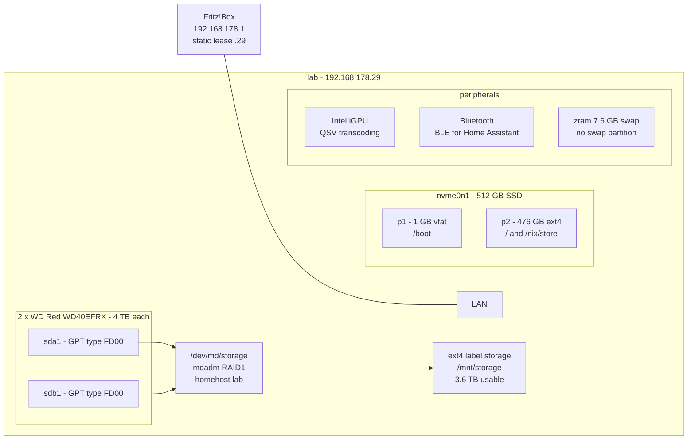
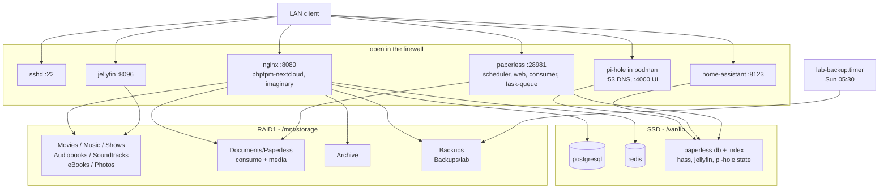

# Home Server - NixOS Configuration

[](https://github.com/antonkesy/home-server/actions/workflows/check.yml)

Home server (`lab`) running Home Assistant, Jellyfin, Nextcloud, Paperless-ngx
and Pi-hole, built from a flake.

## Setup

### Hardware



Building the mirror from blank disks is the **Storage** note below.

### Software



Everything listens directly; the array is the only thing that idles out, so
the services on the left of it stay up and the disks on the right go to
sleep. Not drawn are the jobs that wake them on a schedule - `mdraid-scrub`
and the Paperless sanity check on the first Saturday, `lab-backup` on Sunday
- nor `nix-gc`, `nix-optimise` and `fstrim`, which only ever touch the SSD.

## Install

```bash
nix-shell -p git just
git clone https://github.com/antonkesy/home-server.git && cd home-server
just install
```

`just install` switches the system and sets the password for user `ak`.
Service passwords are generated on the switch (`gen-secrets`) and kept
across rebuilds. On a new machine run `just hardware` first, or
`just migrate` (hardware, install, restore). The two data disks have to be
built into the mirror once by hand; see **Storage** below.

## Services

| Service        | URL                     | Credentials                                   |
| -------------- | ----------------------- | --------------------------------------------- |
| Home Assistant | `http://lab:8123`       | set up on first visit                         |
| Jellyfin       | `http://lab:8096`       | set up on first visit                         |
| Nextcloud      | `http://lab:8080`       | `/var/lib/nextcloud/admin-pass` (user `root`) |
| Paperless-ngx  | `http://lab:28981`      | `/var/lib/paperless/admin-pass` (user `admin`) |
| Pi-hole        | `http://lab:4000/admin` | `/var/lib/pihole/pihole.env`                  |

`just passwords` prints them. Nextcloud reads its file at first setup only;
rotate with `just set-nextcloud-pw`, Pi-hole with `just set-pihole-pw`.

Everything runs all the time and answers immediately. The power saving sits
one level down instead: the two 4 TB disks park after 30 idle minutes
(`storage.standbyMinutes`), which is worth about 6 W against the ~1 W the
idle services cost. Only the SSD stays awake, and Pi-hole - the one service
that runs constantly - lives entirely on it, so DNS never waits for a disk.

The first read from a sleeping array waits five to ten seconds for spin-up.
What wakes the disks: opening Jellyfin, Nextcloud or Paperless; the Sunday
05:30 backup; the first-Saturday scrub and the Paperless sanity check that
rides along with it; and any `nixos-rebuild switch` that changes `smartd`,
because smartd spins both disks up when it starts. Nothing else should -
`smartd` polls with `-n standby,q` so it skips a parked disk silently, and
Nextcloud's `files_no_background_scan` stops cron from walking the array.

## Day to day

`just --list` shows every recipe. Three things it cannot tell you:
`update` and `upgrade` only stage the next boot, `install` is the one recipe
that switches live, and `clean` drops the generations `rollback` needs.
Garbage collection also runs on its own every Sunday, keeping 30 days.

## Backup & restore

`just backup [dir]` writes one `lab-<date>.tar.zst` to
`/mnt/storage/Backups/lab`; `lab-backup.timer` does the same every Sunday
morning and keeps the last eight (`backup` in `settings.nix`). `Backups` is a
Nextcloud external storage like every other directory on the array, so an
archive - and with it the service passwords and the SSH host keys - is one
Nextcloud login away. Inside:

- the generated passwords, the SSH host keys
- Nextcloud: `config.php`, installed apps, app data, a Postgres dump
- Paperless: database and secret key (the search index is rebuilt on start)
- Home Assistant: `.storage` (integrations, auth, devices)
- Jellyfin: config, library database, plugins
- Pi-hole: `pihole.toml`, `gravity.db`, `dnsmasq.d`

Not inside: user files, media, Paperless documents, previews, caches, logs,
Home Assistant history. The mirror is what covers those, and it only covers
one disk dying - the archive now sits on the same machine as the state it
backs up, so fire, theft or a dead PSU takes both. `just backup /run/media/...`
onto an external disk now and then is the only thing that does not.
Jellyfin, Paperless and Pi-hole are stopped for the duration of the tar, so
LAN DNS is briefly gone; the copy is compared against the staged archive
after a sync.

`just restore [archive]` takes the newest archive in the backup dir, or a
path. It stops the services, extracts over `/var/lib`, recreates the
Nextcloud database, restarts `sshd` with the old host keys and re-runs
`nextcloud-setup`. Restore onto the same or a newer nixpkgs than the archive
(`manifest` inside says which).

## Notes

- **Site settings** live in `settings.nix`: hostname, addresses, ports,
  storage directories, timezone, git identity. The modules only read them.
- **SSH.** Password authentication stays on until a key is in
  `modules/users.nix`; then set `PasswordAuthentication = false` in
  `modules/ssh.nix`.
- **Pi-hole** is v6: settings use `FTLCONF_<section>_<key>` and are read-only
  in the web UI. Allow/deny entries are listed in `settings.nix`
  (`pihole.domains`) and added on every boot; deleting one there does not
  remove it from Pi-hole. The host itself resolves through public DNS, so a broken
  container cannot lock you out of `just rollback`.
- **LAN names.** Pi-hole serves `lab` and `lab.fritz.box` from the server's
  `/etc/hosts`; everything else under `fritz.box` is forwarded to the router,
  because `fritz.box` is a real public domain.
- **Nextcloud** is trimmed to file sharing: `nextcloud-disable-apps` turns the
  stock dashboard, activity, photos and similar apps off on every boot, cron
  runs every 15 minutes. `previewgenerator` and `memories` are the exception -
  they are `extraApps`, so Nix owns their directories and `nextcloud-setup`
  re-enables them on every start. Never install or update either from the app
  store: a newer copy in `store-apps` shadows the pinned one. Upgrade one major
  version at a time (`nextcloud35` only once 34 has migrated).
- **Nextcloud previews.** Built ahead of time rather than when the browser asks,
  which is what made a photo folder crawl. Pre-generating the whole array filled
  the SSD once, so it is scoped to `nextcloud.previewDirs` in `settings.nix`;
  everything else still gets its thumbnail on first open, just not in bulk. Two
  units, because the app only queues what Nextcloud itself wrote:
  `nextcloud-preview-pregenerate` drains that queue hourly (uploads), and
  `nextcloud-preview-generate` walks `previewDirs` nightly for everything that
  arrived on the array some other way. The nightly pass is hours the first time
  and minutes after; `just warm-previews` is the same unit by hand. Both skip
  while `/` has less than `nextcloud.previewMinFreeGB` free. The cache is
  `/var/lib/nextcloud/data/appdata_*/preview`, broken out by `just disk`; a
  `.nomedia` file skips a folder.
- **Nextcloud Memories** replaces the stock `photos` app. `just index-photos`
  does the first pass over an existing library; after that its own job indexes
  from cron - scoped by `memories.index.mode`, because the default walks every
  external storage. exiftool and the `go-vod` transcoder come from the nixpkgs
  package, which patches the paths in and rejects any attempt to set them.
  Transcoding is on (upstream ships it off) and uses QSV; go-vod runs as a child
  of php-fpm, which is why the render node is granted on that unit. Everything
  here is in `override.config.php`, so Settings > Memories appears to save and
  has no effect.
- **How Nextcloud notices a file it did not write.** Three ways, because
  `files_no_background_scan` keeps cron off the array. Each mount is created
  with `filesystem_check_changes 1`, so opening a folder re-checks it - that
  is what covers a file the moment you look for it. `nextcloud-media-watch`
  maps an inotify event to the mount it happened in and starts
  `nextcloud-media-scan@<mount>`, which indexes that one storage; only
  Paperless' `consume/` is pruned from the watch, since it churns on every
  document eaten. And `nextcloud-media-scan` indexes all of them once at
  boot, for whatever changed while the watch was down - `just scan` is the
  same unit by hand. A mount that does not exist yet is reported and skipped,
  so one gap cannot cost the others their scan.
- **Storage** (`modules/storage.nix`): two 4 TB disks as one mdadm RAID1
  mirror, ext4 at `/mnt/storage`, directories from `storage.dirs`. Assembly is
  by homehost and the mount is by filesystem label, so no disk, UUID or
  `/dev/mdN` appears in the repo and the config holds before the array exists:
  `mdadm --create ... --homehost=lab --name=storage` over one `FD00` partition
  per disk, then `mkfs.ext4 -L storage`. The mount is `nofail`, and every unit
  that writes there waits on it with `RequiresMountsFor` rather than risk
  building a tree on the SSD - Jellyfin included, because a library scan against
  an unmounted array empties the library.

  One rule holds the tree together: every service that touches it is in `lab`,
  writes with `UMask=0002`, and the directories carry setgid plus a default
  `g::rwX` ACL, which is what makes the creating process's umask irrelevant.
  `storage-dirs` re-asserts that on every boot. It covers the directories, not
  their contents - `cp -a`, `rsync -a` or a copy made as root re-apply the
  source modes - so the unit also holds a recursive repair, guarded by a stamp
  in `/mnt/storage/.storage-dirs` that hashes the directory list and owner.
  Change `storage.dirs` and the next boot walks the array once, then never
  again; `just fix-perms` forces that pass by hand.

  Health and power: `just storage` prints array state and whether the disks are
  spinning, `mdmonitor` logs a degraded array through `systemd-cat`, `smartd`
  warns about a dying disk, and `mdraid-scrub` read-checks the mirror on the
  first Saturday (`storage.scrubOnCalendar`). A udev rule sets the 30-minute ATA
  standby timer on whichever devices carry the RAID superblock, so no serial is
  hardcoded; a USB bridge that rejects the command is ignored and the
  enclosure's own idle timer takes over. Jellyfin's libraries still have to be
  pointed at `/mnt/storage/{Movies,Music,Shows}` by hand in its dashboard.
- **Paperless** keeps its documents in `/mnt/storage/Documents/Paperless`
  (`paperless.dir`). Drop a scan into `consume/` by any route and inotify picks
  it up; unparsable files stay behind there. It keeps
  `media/documents/originals` and `media/documents/archive` (the OCR'd PDF/A),
  both readable through Nextcloud as long as nothing renames them behind the
  database's back. The units run with `UMask=0002` rather than upstream's 0066,
  which is what makes a new document readable outside paperless at all -
  paperless copies a file's mode along with the file, so the ACL does not cover
  this. In exchange `/var/lib/paperless` is pinned to 0700, for the database and
  the secret key.
- **Jellyfin hardware transcoding** (Intel QuickSync) still has to be
  enabled in Dashboard > Playback.
- **Jellyfin's scheduled tasks live in its own data dir, not in nixpkgs.**
  Left running, the library scan wakes the array twice a day for nothing - turn
  the periodic trigger off under Dashboard > Scheduled Tasks and scan by hand
  after adding media. The same dashboard owns the listen port, which is why
  `ports.jellyfin` only describes what is already in `network.xml`.
- **Formatting** is checked in CI (`nix fmt`), `hardware-configuration.nix`
  included.

## Problems & Fixes

- **`ssh lab`: connection refused.** `lab` resolves to loopback. Check
  `dig +short lab @192.168.178.29`; `127.0.0.2` means Pi-hole serves a stale
  `/etc/hosts`: `sudo systemctl restart podman-pihole`.
- **No DNS on the server.** `just tmp-dns` writes a public resolver into
  `/etc/resolv.conf`.
- **The array is degraded.** `just storage` names the missing member.
  Partition the replacement the same way (one GPT partition, type `FD00`),
  then `sudo mdadm /dev/md/storage --add /dev/disk/by-id/<new>-part1` and
  watch the resync in `/proc/mdstat`. The filesystem stays up throughout.
- **No delete or rename in Nextcloud.** A local external storage takes every
  permission from the filesystem, so the action is missing wherever
  `nextcloud` cannot write - usually content copied onto the array as root.
  `sudo -u nextcloud test -w /mnt/storage/Movies/<subdir>` says whether that
  is it; `just fix-perms`, then `just scan`.
- **A rebuild left the machine broken.** Pick the previous generation in the
  systemd-boot menu, or `just rollback`. Ten generations are kept; the kernel
  reboots 30 s after a panic.
