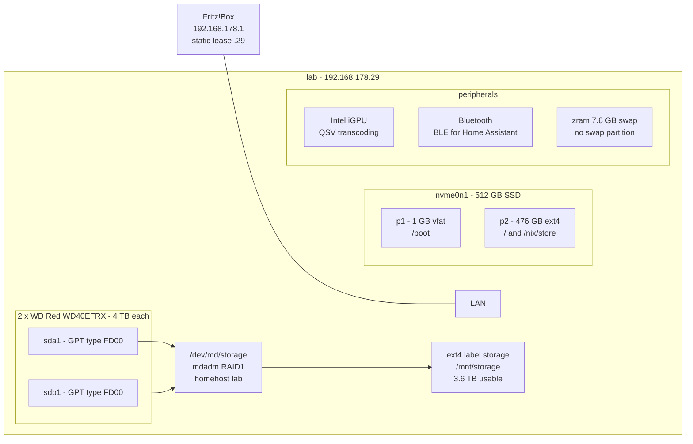
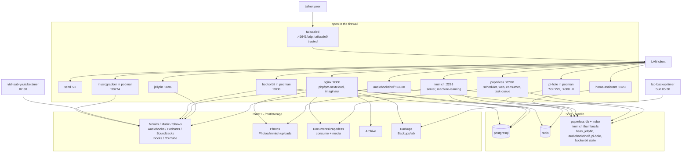

# Home Server - NixOS Configuration

[](https://github.com/antonkesy/home-server/actions/workflows/check.yml)

Home server (`lab`) running Home Assistant, Immich, Jellyfin, Audiobookshelf,
Nextcloud, Paperless-ngx, Pi-hole, MusicGrabber, BookOrbit, ytdl-sub and
Tailscale, built from a flake.

## Setup

### Hardware


```mermaid
flowchart LR
  router["Fritz!Box<br>192.168.178.1<br>static lease .29"] --- nic["LAN"]

  subgraph lab["lab - 192.168.178.29"]
    nic

    subgraph nvme["nvme0n1 - 512 GB SSD"]
      p1["p1 - 1 GB vfat<br>/boot"]
      p2["p2 - 476 GB ext4<br>/ and /nix/store"]
    end

    subgraph disks["2 x WD Red WD40EFRX - 4 TB each"]
      sda["sda1 - GPT type FD00"]
      sdb["sdb1 - GPT type FD00"]
    end

    md["/dev/md/storage<br>mdadm RAID1<br>homehost lab"]
    ext4["ext4 label storage<br>/mnt/storage<br>3.6 TB usable"]

    subgraph periph["peripherals"]
      igpu["Intel iGPU<br>QSV transcoding"]
      ble["Bluetooth<br>BLE for Home Assistant"]
      zram["zram 7.6 GB swap<br>no swap partition"]
    end
  end

  sda --> md
  sdb --> md
  md --> ext4
```

Building the mirror from blank disks is the **Storage** note below.

### Software


```mermaid
flowchart TD
  client["LAN client"]

  subgraph fw["open in the firewall"]
    ssh["sshd :22"]
    ts["tailscaled<br>:41641/udp, tailscale0 trusted"]
    ph["pi-hole in podman<br>:53 DNS, :4000 UI"]
    has["home-assistant :8123"]
    ncb["nginx :8080<br>phpfpm-nextcloud, imaginary"]
    jfb["jellyfin :8096"]
    abs["audiobookshelf :13378"]
    plb["paperless :28981<br>scheduler, web, consumer, task-queue"]
    imb["immich :2283<br>server, machine-learning"]
    mgb["musicgrabber in podman<br>:38274"]
    bob["bookorbit in podman<br>:3000"]
  end

  yts["ytdl-sub-youtube.timer<br>02:30"]

  subgraph ssdg["SSD - /var/lib"]
    pg[("postgresql")]
    rd[("redis")]
    st["paperless db + index<br>immich thumbnails<br>hass, jellyfin, audiobookshelf, pi-hole, bookorbit state"]
  end

  subgraph raid["RAID1 - /mnt/storage"]
    med["Movies / Music / Shows<br>Audiobooks / Podcasts / Soundtracks<br>Books / YouTube"]
    pho["Photos<br>Photos/Immich uploads"]
    doc["Documents/Paperless<br>consume + media"]
    arc["Archive"]
    bak["Backups<br>Backups/lab"]
  end

  client --> ssh & ph & has
  remote["tailnet peer"] --> ts --> client
  client --> ncb & jfb & abs & plb & imb & mgb & bob
  mgb --> med
  yts --> med
  bob --> pg
  bob --> med
  ph --> st
  has --> st
  ncb --> pg & rd
  ncb --> med & pho & doc & arc & bak
  jfb --> med
  abs --> med
  abs --> st
  imb --> pg & rd & st
  imb --> pho
  plb --> doc
  plb --> st
  tb["lab-backup.timer<br>Sun 05:30"] --> bak
```

Everything listens directly; the array is the only thing that idles out, so
the services on the left of it stay up and the disks on the right go to
sleep. Not drawn are the jobs that wake them on a schedule - `mdraid-scrub`
and the Paperless sanity check on the first Saturday, `lab-backup` on Sunday
- nor `nix-gc`, `nix-optimise` and `fstrim`, which only ever touch the SSD.

## Install

```bash
nix-shell -p git just
git clone https://github.com/antonkesy/home-server.git && cd home-server
just install
```

`just install` switches the system and sets the password for user `ak`.
Service passwords are generated on the switch (`gen-secrets`) and kept
across rebuilds. On a new machine run `just hardware` first, or
`just migrate` (hardware, install, restore). The two data disks have to be
built into the mirror once by hand; see **Storage** below.

## Services

| Service        | URL                                            | Credentials                                         | Clients                                                                                                                                                                                                                                               |
| -------------- | ---------------------------------------------- | --------------------------------------------------- | ----------------------------------------------------------------------------------------------------------------------------------------------------------------------------------------------------------------------------------------------------- |
| Home Assistant | [http://lab:8123](http://lab:8123)             | set up on first visit                               | [Home Assistant Companion](https://play.google.com/store/apps/details?id=io.homeassistant.companion.android) (Android); web on desktop                                                                                                                |
| Jellyfin       | [http://lab:8096](http://lab:8096)             | set up on first visit                               | [Jellyfin](https://play.google.com/store/apps/details?id=org.jellyfin.mobile) or [Findroid](https://github.com/jarnedemeulemeester/findroid) (Android); [Jellyfin Media Player](https://github.com/jellyfin/jellyfin-media-player/releases) (desktop) |
| Audiobookshelf | [http://lab:13378](http://lab:13378)           | set up on first visit                               | [Audiobookshelf](https://play.google.com/store/apps/details?id=com.audiobookshelf.app) (Android); web on desktop                                                                                                                                      |
| Nextcloud      | [http://lab:8080](http://lab:8080)             | `/var/lib/nextcloud/admin-pass` (user `root`)       | [Nextcloud Files](https://play.google.com/store/apps/details?id=com.nextcloud.client) (Android); [Nextcloud Desktop](https://nextcloud.com/install/) (sync client)                                                                                    |
| Paperless-ngx  | [http://lab:28981](http://lab:28981)           | `/var/lib/paperless/admin-pass` (user `admin`)      | [Paperless Mobile](https://github.com/astubenbord/paperless-mobile) (Android); web on desktop                                                                                                                                                         |
| Immich         | [http://lab:2283](http://lab:2283)             | `/var/lib/immich/admin-pass` (user `adminEmail`)    | [Immich](https://play.google.com/store/apps/details?id=app.alextran.immich) (Android, backs up the camera roll); web on desktop                                                                                                                       |
| MusicGrabber   | [http://lab:38274](http://lab:38274)           | none                                                | web only                                                                                                                                                                                                                                              |
| BookOrbit      | [http://lab:3000](http://lab:3000)             | `/var/lib/bookorbit/admin-pass` (user `adminEmail`) | web; a Kobo syncs against `APP_URL`                                                                                                                                                                                                                   |
| Tailscale      | -                                              | `just tailscale-up` once, logs in via browser       | [Tailscale](https://play.google.com/store/apps/details?id=com.tailscale.ipn) (Android); [desktop clients](https://tailscale.com/download)                                                                                                             |
| Pi-hole        | [http://lab:4000/admin](http://lab:4000/admin) | `/var/lib/pihole/pihole.env`                        | web only                                                                                                                                                                                                                                              |

`just passwords` prints them; `adminEmail` is the login from `settings.nix`.
Nextcloud, Immich and BookOrbit read their file at first setup only; rotate
with `just set-nextcloud-pw`, `just set-immich-pw`, and Pi-hole with
`just set-pihole-pw`.

Everything runs all the time and answers immediately. The power saving sits
one level down instead: the two 4 TB disks park after 30 idle minutes
(`storage.standbyMinutes`), which is worth about 6 W against the ~1 W the
idle services cost. Only the SSD stays awake, and Pi-hole - the one service
that runs constantly - lives entirely on it, so DNS never waits for a disk.

The first read from a sleeping array waits five to ten seconds for spin-up.
What wakes the disks: opening Immich, Jellyfin, Audiobookshelf, Nextcloud,
Paperless or BookOrbit; the
02:30 Nextcloud preview run, and the Immich library scan and the ytdl-sub
run that share its window; the Sunday 05:30 backup; the first-Saturday scrub and the Paperless sanity check that
rides along with it; and any `nixos-rebuild switch` that changes `smartd`,
because smartd spins both disks up when it starts. Nothing else should -
`smartd` polls with `-n standby,q` so it skips a parked disk silently, and
Nextcloud's `files_no_background_scan` stops cron from walking the array.

## Day to day

| Recipe                             | What it does                                                         |
| ---------------------------------- | -------------------------------------------------------------------- |
| `install`                          | first switch, then the password for `ak`; the one that switches live |
| `update`                           | build and stage for the next boot                                    |
| `upgrade`                          | bump nixpkgs, then `update`                                          |
| `build`                            | build without activating                                             |
| `rollback`                         | activate the previous generation                                     |
| `clean`                            | garbage-collect, dropping the generations `rollback` needs           |
| `hardware`                         | regenerate `hardware-configuration.nix`                              |
| `migrate`                          | new machine: `hardware`, `install`, `restore`                        |
| `status`                           | state of every service and timer                                     |
| `logs <unit>`                      | follow one unit's journal                                            |
| `disk`                             | free space on `/` and the array, the big state directories           |
| `storage`                          | mirror health and whether the disks are spinning                     |
| `fix-perms`                        | re-run the array-wide ownership and ACL repair                       |
| `backup [dir]`                     | config and secrets archive, to `Backups/lab` by default              |
| `restore [archive]`                | restore the newest archive, or the given one                         |
| `scan`                             | index what Nextcloud has not seen yet                                |
| `warm-previews`                    | build missing Nextcloud thumbnails now                               |
| `scan-photos`                      | re-assert the Immich library and scan it                             |
| `youtube`                          | download new videos now instead of at 02:30                          |
| `youtube-list`                     | print the followed shows, their seasons and URLs                     |
| `tailscale-up`                     | join the tailnet; re-run after a restore                             |
| `tmp-dns`                          | public DNS in `/etc/resolv.conf` until the next network change       |
| `passwords`                        | print the generated service passwords                                |
| `set-{pihole,nextcloud,immich}-pw` | rotate that service's admin password                                 |

`just --list` prints the same. Three things it cannot tell you:
`update` and `upgrade` only stage the next boot, `install` is the one recipe
that switches live, and `clean` drops the generations `rollback` needs.
Garbage collection also runs on its own every Sunday, keeping 30 days.

### YouTube

`/mnt/storage/YouTube/subscriptions.yaml` is the list of followed channels;
edit it through Nextcloud (`YouTube` share) or on the server, no rebuild.
`just youtube-list` prints it, `just youtube` downloads now instead of at
02:30. One entry per show, one season per URL:

```yaml
coldmirror:
  s01_name: Videos # the channel: every upload no later season claims
  s01_url: https://www.youtube.com/@coldmirror
  s02_name: 5 Minuten Harry Podcast # a playlist
  s02_url: https://www.youtube.com/playlist?list=PLDvBqWb1UAGeEt9n6vFH_zdGw65Obf3sH
```

- The show name is the folder and the Jellyfin title.
- Up to 40 seasons, `s00` is Specials, and a season can take a list of
  URLs (several channels, or single `watch?v=` videos).
- A video in several URLs is downloaded once, into the highest season - so
  put playlists after the channel.
- Playlist URLs: open the playlist and copy its `list=` id; a
  `youtube.com/show/VL<id>` link is the playlist `<id>`.
- A new show downloads its whole history on its first run. Removing an entry
  stops downloads but keeps the files.

### Skipping sponsors in Jellyfin

ytdl-sub writes each SponsorBlock segment into the video as a chapter titled
`[SponsorBlock]: <category>`; where segments overlap, one chapter carries
both, e.g. `[SponsorBlock]: Preview/Recap, Unpaid/Self Promotion`. Jellyfin
turns chapters into *media segments* (Intro, Outro, Preview, Commercial)
with the **Chapter Segments Provider** plugin, and a client skips a segment
type it is told to. None of this is in Nix - Jellyfin keeps it in its data
dir - so, once:

1. Dashboard > Plugins > Catalog: install *Chapter Segments Provider*,
   restart Jellyfin.
2. Its settings, one regex per segment type. Not anchored at the end, so a
   combined chapter matches too:

   | Segment    | Regex                                                                         | Categories                      |
   | ---------- | ----------------------------------------------------------------------------- | ------------------------------- |
   | Commercial | `^\[SponsorBlock\]: .*(Sponsor\|Unpaid/Self Promotion\|Interaction Reminder)` | sponsor, selfpromo, interaction |
   | Intro      | `^\[SponsorBlock\]: .*Intermission/Intro Animation`                           | intro                           |
   | Outro      | `^\[SponsorBlock\]: .*Endcards/Credits`                                       | outro                           |
   | Preview    | `^\[SponsorBlock\]: .*Preview/Recap`                                          | preview                         |

   A combined chapter can match two rows; with both set to *Skip* it is
   skipped either way. Filler Tangent, Non-Music Section and Highlight have
   no segment type;
   they stay ordinary chapters to jump to or past. The `^\[SponsorBlock\]`
   prefix keeps a channel's own chapter called "Intro" out of it.
3. Dashboard > Scheduled Tasks: run the media segment task (or a library
   scan) once; new videos get theirs on every scan after.
4. In every client's playback settings, under media segments: set
   Commercial (and Intro, Outro, Preview, as wanted) to *Skip*, or *Ask to
   skip* for a button instead. Per user and per client: the web UI, the
   Android app and Jellyfin Media Player each need it once.

A video downloaded before a segment was submitted keeps no chapter for it;
`ytdlSub.delayDays` is what makes that rare.

## Backup & restore

`just backup [dir]` writes one `lab-<date>.tar.zst` to
`/mnt/storage/Backups/lab`; `lab-backup.timer` does the same every Sunday
morning and keeps the last eight (`backup` in `settings.nix`). `Backups` is a
Nextcloud external storage like every other directory on the array, so an
archive - and with it the service passwords and the SSH host keys - is one
Nextcloud login away. Inside:

- the generated passwords, the SSH host keys
- Nextcloud: `config.php`, installed apps, app data, a Postgres dump
- Immich: a Postgres dump (albums, people, the library index), avatars
- BookOrbit: a Postgres dump (users, reading progress, the library index),
  the secrets, covers
- Paperless: database and secret key (the search index is rebuilt on start)
- Home Assistant: `.storage` (integrations, auth, devices)
- Jellyfin: config, library database, plugins
- Audiobookshelf: config and database (users, progress, libraries), item
  metadata and covers
- Pi-hole: `pihole.toml`, `gravity.db`, `dnsmasq.d`
- Tailscale: the node key, so a restored machine is the same node
- MusicGrabber: its database (settings, watched playlists)
- ytdl-sub: `YouTube/subscriptions.yaml`

Not inside: user files, media (YouTube downloads too; each show's download
archive is a dotfile next to its videos), Paperless documents, previews, Immich
thumbnails, caches, logs, Home Assistant history. The mirror is what covers those, and it only covers
one disk dying - the archive now sits on the same machine as the state it
backs up, so fire, theft or a dead PSU takes both. `just backup /run/media/...`
onto an external disk now and then is the only thing that does not.
Jellyfin, Audiobookshelf, Paperless and Pi-hole are stopped for the duration of the tar, so
LAN DNS is briefly gone; the copy is compared against the staged archive
after a sync.

`just restore [archive]` takes the newest archive in the backup dir, or a
path. It stops the services, extracts over `/var/lib`, recreates the
Nextcloud database, restarts `sshd` with the old host keys and re-runs
`nextcloud-setup`. Restore onto the same or a newer nixpkgs than the archive
(`manifest` inside says which).

## Notes

- **Site settings** live in `settings.nix`: hostname, addresses, ports,
  storage directories, timezone, git identity. The modules only read them.
- **SSH.** Password authentication stays on until a key is in
  `modules/users.nix`; then set `PasswordAuthentication = false` in
  `modules/ssh.nix`.
- **Pi-hole** is v6: settings use `FTLCONF_<section>_<key>` and are read-only
  in the web UI. Allow/deny entries are listed in `settings.nix`
  (`pihole.domains`) and added on every boot; deleting one there does not
  remove it from Pi-hole. The host itself resolves through public DNS, so a broken
  container cannot lock you out of `just rollback`.
- **LAN names.** Pi-hole serves `lab` and `lab.fritz.box` from the server's
  `/etc/hosts`; everything else under `fritz.box` is forwarded to the router,
  because `fritz.box` is a real public domain.
- **Nextcloud** is trimmed to file sharing: `nextcloud-disable-apps` turns the
  stock dashboard, activity, photos and similar apps off on every boot, cron
  runs every 15 minutes. `previewgenerator` is the exception - it is an
  `extraApp`, so Nix owns its directory and `nextcloud-setup` re-enables it
  on every start. Never install or update it from the app store: a newer copy
  in `store-apps` shadows the pinned one. Upgrade one major
  version at a time (`nextcloud35` only once 34 has migrated).
- **Nextcloud previews.** Built ahead of time rather than when the browser asks,
  which is what made a photo folder crawl. Pre-generating the whole array filled
  the SSD once, so it is scoped to `nextcloud.previewDirs` in `settings.nix`;
  everything else still gets its thumbnail on first open, just not in bulk. Two
  units, because the app only queues what Nextcloud itself wrote:
  `nextcloud-preview-pregenerate` drains that queue hourly (uploads), and
  `nextcloud-preview-generate` walks `previewDirs` nightly for everything that
  arrived on the array some other way. The nightly pass is hours the first time
  and minutes after; `just warm-previews` is the same unit by hand. Both skip
  while `/` has less than `nextcloud.previewMinFreeGB` free. The cache is
  `/var/lib/nextcloud/data/appdata_*/preview`, broken out by `just disk`; a
  `.nomedia` file skips a folder.
- **Immich** owns the photos. `/mnt/storage/Photos` is an *external library*:
  read-only, indexed in place, never copied - the same directory Nextcloud
  serves as `Photos`. Uploads from the app land on the array as well, in
  `Photos/Immich/<user>/<year>/<month>/`, which is `library/` of Immich's
  state dir bind-mounted onto the array; that subtree is excluded from the
  external library (`**/Immich/**`) so nothing is imported twice, and the
  Nextcloud watcher indexes it like any other write to `Photos`. The only
  Immich data on the SSD are thumbnails, transcodes and the database. The
  unit writes with `UMask=0002` like everything else on the array, which is
  what keeps an upload readable for Nextcloud; the `.immich` marker file in
  `Photos/Immich` is Immich's mount check and stays hidden. `immich-setup`
  creates the admin and the library over the API on every boot and queues a
  scan (`just scan-photos` by hand); between boots Immich's own inotify watch
  picks up new files and a nightly scan at 02:30 catches the rest, in the
  window the preview run already wakes the disks for. Settings are in
  `services.immich.settings`, so Administration > Settings is read-only in
  the UI. Transcoding is QSV; the machine-learning models unload after five
  idle minutes.
- **MusicGrabber** (`modules/musicgrabber.nix`) is the "search, tap, done"
  path into the music library: a podman container with `/mnt/storage/Music`
  mounted as its library, writing `<Artist>/<Album>/<nn - Track>` for albums
  and album-attributed singles (`ALBUMS_SUBDIR`/`SINGLES_SUBDIR` are `.`,
  `AUTO_ALBUM_SINGLES` on; a single MusicBrainz cannot place goes to
  `<Artist>/`) as `ak:lab`, mode 664 (`PUID`, `FILE_PERMISSIONS`; the group id is read with `getent` at
  start because NixOS allocates it). Jellyfin's real-time monitoring and the
  Nextcloud watcher pick a new file up on their own, so nothing else runs.
  The image tag is pinned in `settings.nix` (`musicGrabber.image`); its
  state lives on the SSD in `/var/lib/musicgrabber`. Whole albums: Artists
  tab or Bulk Import, pick the release; a followed artist pulls new singles
  on its own, and new albums too with its "automatically add new albums"
  toggle. No login: it is reachable
  on the LAN and the tailnet only - set `API_KEY` in the container
  environment if that changes. The Jellyfin/Navidrome refresh hooks are off.
- **BookOrbit** (`modules/bookorbit.nix`) is the ebook library: a podman
  container with `/mnt/storage/Books` mounted as `/books`, read in place -
  the files stay where Nextcloud already sees them.
  Whatever it writes there (uploads from the web UI, renamed files if that
  is turned on) is `ak:lab` through `PUID`/`PGID`, the group id read with
  `getent` at start like MusicGrabber. The database is the host Postgres
  over its socket, bind-mounted into the container and authenticated by
  peer: the server sees uid 1000, an ident map turns that into the
  `bookorbit` role, so there is no password. Its extensions (`vector`,
  `pg_trgm`, `unaccent`, `uuid-ossp`) are created by `postgresql-setup`,
  the way Immich's are. `bookorbit-setup` creates the admin over the
  token-gated setup endpoint on every boot (a no-op once it exists); the
  token and the JWT secret are generated into
  `/var/lib/bookorbit/bookorbit.env` by `gen-secrets`. Covers and the
  upload staging area live on the SSD in `/var/lib/bookorbit/data`. The
  image tag is pinned in `settings.nix` (`bookOrbit.image`); the container
  runs read-only with the capabilities upstream's compose grants and nothing
  more. `APP_URL` is `http://lab.fritz.box:3000`, which is what a Kobo gets
  told to sync against.
- **ytdl-sub** (`modules/ytdl-sub.nix`) archives YouTube channels into
  `/mnt/storage/YouTube` as Jellyfin TV shows; adding one is under **Day to
  day**. There is no web UI and no port. `ytdl-sub-youtube.timer` runs the
  nixpkgs module's oneshot nightly at 02:30, and before each run
  `ytdl-sub-youtube-prepare` wraps `YouTube/subscriptions.yaml` - only the
  shows, so it stays editable in Nextcloud without a rebuild - into the
  *Jellyfin TV Show Collection* preset, the quality (`ytdlSub.quality`:
  the best youtube has, 4K included, merged into mp4 - a 4K channel is tens
  of GB), the SponsorBlock chapters and the target directory, all of which
  stay in Nix. A missing file is seeded from `ytdlSub.initialShows`; a broken one
  fails the run with yq's parse error in `just logs ytdl-sub-youtube`.
  Videos are
  staged on the SSD in `/var/lib/ytdl-sub/youtube/working` rather than
  upstream's `/run`, which is RAM. The unit runs in `lab` with `UMask=0002`
  and without upstream's `PrivateUsers`, which would leave `lab` unmapped. It
  waits on the array, because the per-show download archives live there and
  a run without them would start every show over on the SSD. In Jellyfin, add
  `/mnt/storage/YouTube` by hand as a *Shows* library with the NFO metadata
  reader on and the online metadata fetchers off; ytdl-sub writes the NFOs
  and posters. yt-dlp comes from nixpkgs, so when YouTube breaks it, the fix
  is `just upgrade`.

  SponsorBlock segments are marked, never cut: every category in
  `ytdlSub.sponsorBlock` is embedded as a chapter, and Jellyfin skips them
  (**Skipping sponsors in Jellyfin** below). SponsorBlock is crowd-sourced
  and a video is fetched exactly once, so ytdl-sub waits until a video is
  `ytdlSub.delayDays` (3) old; a newer one is left for a later run. The
  `[SponsorBlock]` chapter titles are yt-dlp's.
- **Tailscale** (`modules/tailscale.nix`) makes lab reachable from outside.
  `just tailscale-up` once prints the login URL; the node key then lives in
  `/var/lib/tailscale` and is in the backup. `tailscale0` is a trusted
  interface, so every service answers to a tailnet peer as it would on the
  LAN. The node advertises `192.168.178.0/24` - approve the route in the
  admin console to reach the rest of the LAN through it - and keeps its own
  DNS (`--accept-dns=false`), because the Pi-hole on this host would
  otherwise be replaced by the tailnet's MagicDNS. Flags are in
  `extraSetFlags` and re-applied on every start.
- **How Nextcloud notices a file it did not write.** Three ways, because
  `files_no_background_scan` keeps cron off the array. Each mount is created
  with `filesystem_check_changes 1`, so opening a folder re-checks it - that
  is what covers a file the moment you look for it. `nextcloud-media-watch`
  maps an inotify event to the mount it happened in and starts
  `nextcloud-media-scan@<mount>`, which indexes that one storage; only
  Paperless' `consume/` is pruned from the watch, since it churns on every
  document eaten. And `nextcloud-media-scan` indexes all of them once at
  boot, for whatever changed while the watch was down - `just scan` is the
  same unit by hand. A mount that does not exist yet is reported and skipped,
  so one gap cannot cost the others their scan.
- **Storage** (`modules/storage.nix`): two 4 TB disks as one mdadm RAID1
  mirror, ext4 at `/mnt/storage`, directories from `storage.dirs`. Assembly is
  by homehost and the mount is by filesystem label, so no disk, UUID or
  `/dev/mdN` appears in the repo and the config holds before the array exists:
  `mdadm --create ... --homehost=lab --name=storage` over one `FD00` partition
  per disk, then `mkfs.ext4 -L storage`. The mount is `nofail`, and every unit
  that writes there waits on it with `RequiresMountsFor` rather than risk
  building a tree on the SSD - Jellyfin included, because a library scan against
  an unmounted array empties the library.

  One rule holds the tree together: every service that touches it is in `lab`,
  writes with `UMask=0002`, and the directories carry setgid plus a default
  `g::rwX` ACL, which is what makes the creating process's umask irrelevant.
  `storage-dirs` re-asserts that on every boot. It covers the directories, not
  their contents - `cp -a`, `rsync -a` or a copy made as root re-apply the
  source modes - so the unit also holds a recursive repair, guarded by a stamp
  in `/mnt/storage/.storage-dirs` that hashes the directory list and owner.
  Change `storage.dirs` and the next boot walks the array once, then never
  again; `just fix-perms` forces that pass by hand.

  Health and power: `just storage` prints array state and whether the disks are
  spinning, `mdmonitor` logs a degraded array through `systemd-cat`, `smartd`
  warns about a dying disk, and `mdraid-scrub` read-checks the mirror on the
  first Saturday (`storage.scrubOnCalendar`). A udev rule sets the 30-minute ATA
  standby timer on whichever devices carry the RAID superblock, so no serial is
  hardcoded; a USB bridge that rejects the command is ignored and the
  enclosure's own idle timer takes over. Jellyfin's libraries still have to be
  pointed at `/mnt/storage/{Movies,Music,Shows,YouTube}` by hand in its dashboard.
- **Paperless** keeps its documents in `/mnt/storage/Documents/Paperless`
  (`paperless.dir`). Drop a scan into `consume/` by any route and inotify picks
  it up; unparsable files stay behind there. It keeps
  `media/documents/originals` and `media/documents/archive` (the OCR'd PDF/A),
  both readable through Nextcloud as long as nothing renames them behind the
  database's back. The units run with `UMask=0002` rather than upstream's 0066,
  which is what makes a new document readable outside paperless at all -
  paperless copies a file's mode along with the file, so the ACL does not cover
  this. In exchange `/var/lib/paperless` is pinned to 0700, for the database and
  the secret key.
- **Jellyfin hardware transcoding** (Intel QuickSync) still has to be
  enabled in Dashboard > Playback.
- **Audiobookshelf** (`modules/audiobookshelf.nix`) serves audiobooks and
  podcasts from the nixpkgs module, state in `/var/lib/audiobookshelf`. The
  libraries - `/mnt/storage/Audiobooks` and `/mnt/storage/Podcasts`
  (`audiobookshelf.*Dir`) - are added by hand in Settings > Libraries, as with
  Jellyfin. The unit runs in `lab` with `UMask=0002`, so podcast downloads and
  covers stored next to the item stay readable for Nextcloud and `ak`. It
  watches the libraries with inotify and has no periodic scan of its own, so
  it leaves a parked array alone; a podcast library with auto-download on is
  the one thing that would wake it on a schedule.
- **Jellyfin's scheduled tasks live in its own data dir, not in nixpkgs.**
  Left running, the library scan wakes the array twice a day for nothing - turn
  the periodic trigger off under Dashboard > Scheduled Tasks and scan by hand
  after adding media. The same dashboard owns the listen port, which is why
  `ports.jellyfin` only describes what is already in `network.xml`.
- **Formatting** is checked in CI (`nix fmt`), `hardware-configuration.nix`
  included.

## Problems & Fixes

- **`ssh lab`: connection refused.** `lab` resolves to loopback. Check
  `dig +short lab @192.168.178.29`; `127.0.0.2` means Pi-hole serves a stale
  `/etc/hosts`: `sudo systemctl restart podman-pihole`.
- **No DNS on the server.** `just tmp-dns` writes a public resolver into
  `/etc/resolv.conf`.
- **The array is degraded.** `just storage` names the missing member.
  Partition the replacement the same way (one GPT partition, type `FD00`),
  then `sudo mdadm /dev/md/storage --add /dev/disk/by-id/<new>-part1` and
  watch the resync in `/proc/mdstat`. The filesystem stays up throughout.
- **No delete or rename in Nextcloud.** A local external storage takes every
  permission from the filesystem, so the action is missing wherever
  `nextcloud` cannot write - usually content copied onto the array as root.
  `sudo -u nextcloud test -w /mnt/storage/Movies/<subdir>` says whether that
  is it; `just fix-perms`, then `just scan`.
- **A rebuild left the machine broken.** Pick the previous generation in the
  systemd-boot menu, or `just rollback`. Ten generations are kept; the kernel
  reboots 30 s after a panic.
